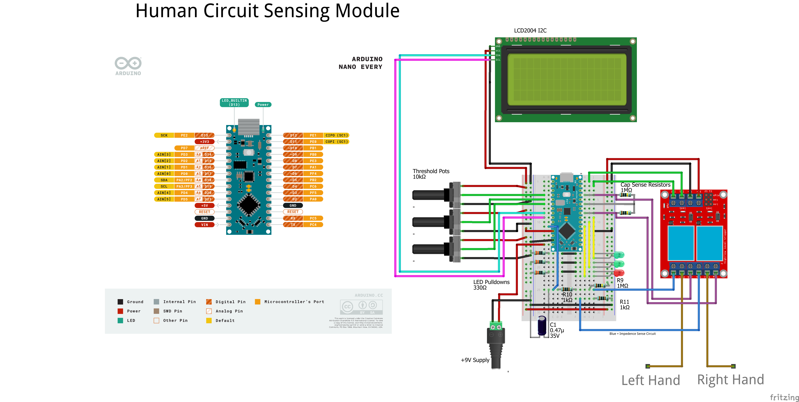

# Human Circuit Sensing Module

## Libraries

- [CapacitiveSensor](https://github.com/PaulStoffregen/CapacitiveSensor)
  - NOTE: The Arduino Nano Every needs an update to the library's header file due to updated register addresses, [details can be found here](https://forum.arduino.cc/t/capacitive-touch-sensing-with-nano-every/1086407)

## Diagrams
